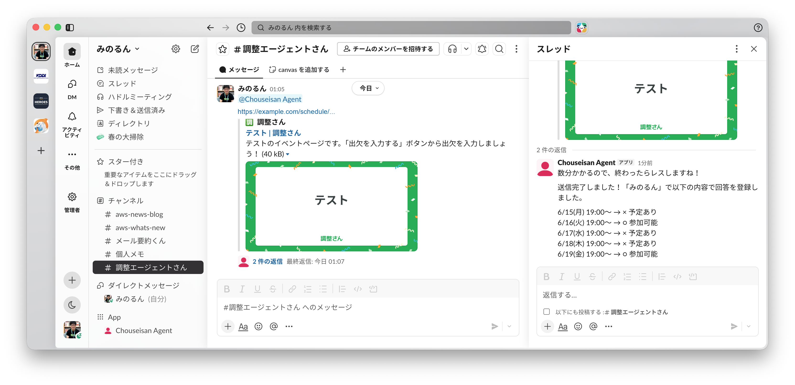
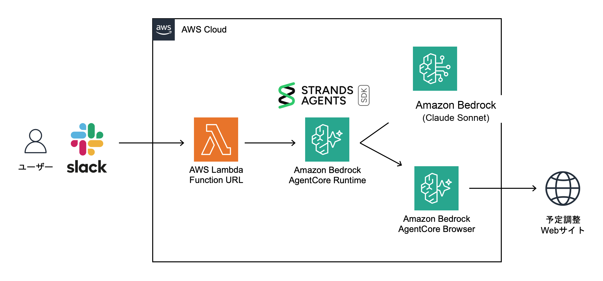

# Slackから日程調整URLを丸投げできるAIエージェントを構築してみよう！

こんにちは！AWS AI Heroのみのるんです。
AIエージェントが話題の昨今ですが、みなさん活用できていますでしょうか？

AIエージェントというと、専用のチャット画面を用意して、そこに質問を投げるものを想像しがちです。それも便利ですが、日常の細かい作業では、Slackのようないつもの場所からそのまま頼める方がありがたい場面も多いでしょう。

例えば、多くの人が日常で遭遇しそうな雑務として「飲み会などの日程調整」を取り上げてみます。
よくあるWebサービスで、みんなが都合の良し悪しを○や×で記入するタイプのものがあると思います。あの調整ページを人間が開いて、カレンダーとにらめっこしなくても、URLをそのままエージェントに丸投げできると便利ですよね。

今回は、Slackに日程調整ページのURLを投げると、エージェントがブラウザでページを開き、Googleカレンダーと突き合わせ、迷わなければそのまま入力するBotを作ります。



このサンプルでは、エージェントの中身をStrands Agents（ https://strandsagents.com/ ）で書きます。
Strands Agentsは、モデル・システムプロンプト・ツールを組み合わせてエージェントを作るためのオープンソースSDKです。簡単なコードで賢いエージェントを書けるのが特徴で、PythonとTypeScriptに対応しています。

そのStrands AgentをAWS上で動かす場所として、最新サービスのAmazon Bedrock AgentCoreを使います。AgentCoreの「ランタイム」という実行環境で動くエージェントが、AgentCoreの「ブラウザ」ツールを使って調整ページへの記入を行います。



この記事では、Macでローカル開発する場合を例にハンズオンの流れをざっくり紹介します。WindowsやLinuxの方は、パスやシェルコマンドを適宜読み替えてください。

完全なコードは、GitHubリポジトリ（ https://github.com/minorun365/chosei-agent ）で公開しています。本文では、手順を上から追えるようにしながら、載せるコードは主要部だけに絞っています。

## 作るもの

作る部品は、Slackの受け口、AgentCoreランタイム、Googleカレンダー確認用のツールの3つです。

```text
Slackアプリ
  ↓
  ↓ メンション
  ↓
Lambda 関数URL
  ├─ Slack署名検証
  ├─ チーム / チャンネル確認
  └─ Slackスレッド返信
  ↓
  ↓ エージェント呼び出し
  ↓
AgentCoreランタイム
  ├─ Strands Agent
  ├─ AgentCoreブラウザ
  └─ Googleカレンダー確認ツール
```

SlackからAgentCoreランタイムを直接呼ばず、間にLambdaを置きます。SlackにはURL verificationや署名検証があり、この処理をランタイム本体へ混ぜると、Slack対応のコードと日程調整のコードがすぐ絡まってしまうためです。

LambdaはSlackの受け口だけを担当します。Slackの署名を検証し、Slackスレッドから `session_id` を作り、本文をランタイムの `prompt` に渡します。候補日の読み取り、Googleカレンダー確認、入力するか聞き返すかの判断はランタイム側で行います。

なお、AWSのサーバーレスサービスのみを使っているため、少額の従量課金で試すことができます。何度か動かす程度であれば数十円〜数百円レベルから利用できるため手軽です。かつ、料金の大部分はAmazon BedrockのAPI（Anthropic Claudeモデルの呼び出し）が占める形となるはずです。
料金についてはご自身の責任でハンズオンを実施いただくようお願いします。

## ローカル環境を用意する

この記事ではMacでローカル開発します。WindowsやLinuxの方は、パスやシェルコマンドを読み替えてください。
以下を準備してから、次の手順に進みましょう。

- AWSアカウントの作成
- Amazon BedrockのプレイグラウンドからClaudeモデルの初回呼び出し
- AWS CLI v2の最新バージョン（[インストール手順](https://docs.aws.amazon.com/cli/latest/userguide/getting-started-install.html)）
- Node.jsとnpm（v22以上）
- Docker Desktopなど、Dockerイメージをビルドできる環境。
- Python 3.10以上
- VS Codeなどのコードエディタ

AWSのリージョンは東京（ `ap-northeast-1` ）を使います。

## プロジェクトを作る

まず作業ディレクトリを作ります。

```sh
mkdir chosei-agent
cd chosei-agent
mkdir -p agent lambda cdk
```

今回はなるべくコードをシンプルにして理解しやすくするため、 `cdk init` コマンドは使わずに直接ファイルを作成していきましょう。

```text
chosei-agent/
├── cdk.json
├── package.json
├── tsconfig.json
├── cdk/  # AWS CDKのインフラコード
│   └── cdk.ts
├── lambda/  # Slackとエージェントを繋ぐLambda関数
│   └── index.ts
└── agent/  # Strandsのエージェント本体
    ├── calendar_tool.py
    ├── Dockerfile
    ├── main.py
    └── requirements.txt
```

ここでは、 `agent/` をAgentCoreランタイム上にコンテナとしてデプロイし、 `lambda/` をSlackからの入口として置く、という関係だけ押さえてください。
Node.js側の依存関係をインストールしましょう。

```sh
npm init -y
npm install aws-cdk-lib constructs @aws-sdk/client-bedrock-agentcore @aws-sdk/client-lambda
npm install -D aws-cdk typescript @types/node esbuild
```

`package.json` のscriptsは、この記事ではこの2つだけ使います。

```json
{
  "scripts": {
    "build": "tsc",
    "cdk": "npm run build && cdk"
  }
}
```

`cdk.json` には、CDKアプリの入口を指定します。

```json
{
  "app": "node dist/cdk/cdk.js"
}
```

## ランタイムを作る

まずエージェント本体を置く `agent/` から作ります。Slackから届いたテキストを受け取り、Strands Agentsに渡す部分です。
`agent/requirements.txt` に必要なPythonパッケージを書きます。

```text
aws-opentelemetry-distro
bedrock-agentcore
nest-asyncio
playwright
strands-agents
strands-agents-tools
```

AgentCoreランタイムにデプロイするエージェントのコンテナ定義を `agent/Dockerfile` として作成します。
ADOT（AWS Distro for OpenTelemetry）を有効にしているので、デプロイしたエージェントの動作トレースがCloudWatchから監視できるようになります。

```dockerfile
FROM public.ecr.aws/docker/library/python:3.13-slim

WORKDIR /app
ENV PYTHONUNBUFFERED=1
RUN useradd -m -u 1000 bedrock_agentcore

COPY requirements.txt .
RUN pip install --no-cache-dir -r requirements.txt

COPY --chown=bedrock_agentcore:bedrock_agentcore . .
EXPOSE 8080
USER bedrock_agentcore
CMD ["opentelemetry-instrument", "python", "main.py"]
```

Googleカレンダーを見る処理は `agent/calendar_tool.py` に分けます。ランタイムの入口と外部APIの処理を分けておくと、あとで読み返したときに迷いにくくなります。

ここでは候補日時の配列を受け取り、それぞれについて `○` / `×` を返す `check_availability` を作ります。エージェントには、候補開始時刻を日本時間の形式にしてからこのツールを呼ぶように伝えます。

```python
from __future__ import annotations

import json
import os
import urllib.parse
import urllib.request
from datetime import datetime, timedelta
from zoneinfo import ZoneInfo

from strands import tool

JST = ZoneInfo("Asia/Tokyo")


# GoogleカレンダーAPI用のアクセストークンを取得する
def google_access_token() -> str:
    body = urllib.parse.urlencode(
        {
            "client_id": os.environ["GOOGLE_CLIENT_ID"],
            "client_secret": os.environ["GOOGLE_CLIENT_SECRET"],
            "refresh_token": os.environ["GOOGLE_REFRESH_TOKEN"],
            "grant_type": "refresh_token",
        }
    ).encode("utf-8")
    request = urllib.request.Request(
        "https://oauth2.googleapis.com/token",
        data=body,
        headers={"Content-Type": "application/x-www-form-urlencoded"},
        method="POST",
    )
    with urllib.request.urlopen(request, timeout=20) as response:
        return json.loads(response.read().decode("utf-8"))["access_token"]


# ISO 8601の日時をJST基準にそろえる
def parse_jst(value: str) -> datetime:
    parsed = datetime.fromisoformat(value.strip().replace("Z", "+00:00"))
    if parsed.tzinfo is None:
        parsed = parsed.replace(tzinfo=JST)
    return parsed.astimezone(JST)


# Googleカレンダーから指定範囲に重なる予定を取得する
def calendar_events(time_min: datetime, time_max: datetime) -> list[tuple[datetime, datetime]]:
    calendar_id = urllib.parse.quote(os.getenv("GOOGLE_CALENDAR_ID", "primary"), safe="")
    query = urllib.parse.urlencode(
        {
            "timeMin": time_min.isoformat(),
            "timeMax": time_max.isoformat(),
            "singleEvents": "true",
            "orderBy": "startTime",
            "timeZone": "Asia/Tokyo",
        }
    )
    request = urllib.request.Request(
        f"https://www.googleapis.com/calendar/v3/calendars/{calendar_id}/events?{query}",
        headers={"Authorization": f"Bearer {google_access_token()}"},
    )
    with urllib.request.urlopen(request, timeout=20) as response:
        data = json.loads(response.read().decode("utf-8"))

    events = []
    for item in data.get("items", []):
        start = item.get("start", {}).get("dateTime") or item.get("start", {}).get("date")
        end = item.get("end", {}).get("dateTime") or item.get("end", {}).get("date")
        if item.get("status") != "cancelled" and item.get("transparency") != "transparent" and start and end:
            events.append((parse_jst(start), parse_jst(end)))
    return events


# 候補日時ごとの空き状況をJSTで判定する
@tool
def check_availability(candidates: list[str], duration_minutes: int = 60) -> list[dict[str, str]]:
    """候補日時ごとの予定有無を確認する

    Args:
        candidates: 候補開始時刻の配列。必ずJSTのISO 8601形式で指定する
        duration_minutes: 各候補の長さ。終了時刻がページにない場合は60分で確認する
    """

    slots = []
    for candidate in candidates:
        start = parse_jst(candidate)
        slots.append((candidate, start, start + timedelta(minutes=duration_minutes)))

    if not slots:
        return []

    events = calendar_events(min(slot[1] for slot in slots), max(slot[2] for slot in slots))
    results = []
    for original, start, end in slots:
        busy_count = sum(1 for event_start, event_end in events if start < event_end and event_start < end)
        results.append(
            {
                "candidate": original,
                "start_jst": start.strftime("%Y-%m-%d %H:%M"),
                "end_jst": end.strftime("%Y-%m-%d %H:%M"),
                "availability": "予定あり" if busy_count else "予定なし",
                "answer": "×" if busy_count else "○",
                "busy_count": str(busy_count),
            }
        )
    return results
```

GoogleカレンダーAPIから予定タイトルは取りません。ツールの返却値も `予定あり` / `予定なし` と `○` / `×` だけにしています。セキュリティに配慮して、Slackに予定名を出さないためです。

次に、メインのエージェントAPIとなる `agent/main.py` を作ります。Slackから届いた本文を `prompt` として受け取り、Strands Agentに渡すファイルです。

```python
from __future__ import annotations

import os
from datetime import datetime
from typing import Any
from zoneinfo import ZoneInfo

from bedrock_agentcore import BedrockAgentCoreApp
from calendar_tool import check_availability
from strands import Agent
from strands.models import BedrockModel
from strands_tools.browser import AgentCoreBrowser

app = BedrockAgentCoreApp()

REGION = os.getenv("AWS_REGION") or os.getenv("AWS_DEFAULT_REGION") or "ap-northeast-1"
MODEL_ID = os.getenv("BEDROCK_MODEL_ID", "jp.anthropic.claude-sonnet-4-6")
DISPLAY_NAME = os.getenv("SCHEDULING_DISPLAY_NAME")
JST = ZoneInfo("Asia/Tokyo")


# エージェントを作成する関数
def create_agent() -> Agent:
    today = datetime.now(JST).date().isoformat()
    system_prompt = f"""
あなたは日程調整ページの代理入力エージェントです。今日の日付は {today}、タイムゾーンはAsia/Tokyoです。
BrowserでURLを開き、候補日時を読み取り、候補開始時刻をJSTのISO 8601形式に変換してcheck_availabilityで予定を確認してください。
check_availabilityのanswerが○なら参加可能、×なら予定ありとして入力し、表示名「{DISPLAY_NAME}」で送信してください。
カレンダーの予定名はユーザーに出さず、予定あり/なしだけで扱ってください。
あなたの返答はSlackに表示されるので、太字や表などのマークダウンは使わず、見やすいプレーンテキストで返信してください。
"""

    browser = AgentCoreBrowser()
    return Agent(
        model=BedrockModel(region_name=REGION, model_id=MODEL_ID),
        system_prompt=system_prompt,
        tools=[browser.browser, check_availability],
    )


# AgentCoreランタイムの入口で、Slack本文をそのままAgentへ渡す
@app.entrypoint
def invoke(payload: dict[str, Any] | None, context: Any = None) -> dict[str, str]:
    payload = payload or {}
    prompt = payload.get("prompt") or payload.get("text") or ""
    if not prompt:
        return {"message": "日程調整ページのURLを含めて依頼してください。"}

    agent = create_agent()
    result = agent(prompt)
    return {"message": str(result)}


if __name__ == "__main__":
    app.run()
```

`create_agent()` で毎回Agentを作っているのは、Slackの別スレッドの会話履歴を持ち越さないためです。

このサンプルでは、Python側に「調整さんのこのフォーム名を探す」といったページ固有の処理を書きません。ページを開く、候補を読む、入力欄を探す、送信する、という判断はStrands Agentに任せます。
Agentがブラウザ操作を必要だと判断したときに、ツールとして渡したAgentCoreブラウザが使われます。

## Slack受信用Lambdaを作る

次に、Slackからのイベントを受けるLambdaを作ります。
SlackのEvents APIは、最初に `url_verification` を送ってきます。通常のイベントでは、 `X-Slack-Signature` と `X-Slack-Request-Timestamp` を使って署名を検証します。

Lambdaのコード `lambda/index.ts` は少し長いので、中心部分だけ載せます。

```ts
import {
  BedrockAgentCoreClient,
  InvokeAgentRuntimeCommand,
} from "@aws-sdk/client-bedrock-agentcore";
import { InvokeCommand, LambdaClient } from "@aws-sdk/client-lambda";

const agentcore = new BedrockAgentCoreClient({
  region: process.env.AWS_REGION ?? "ap-northeast-1",
});
const lambda = new LambdaClient({
  region: process.env.AWS_REGION ?? "ap-northeast-1",
});

type WorkItem = {
  type: "run_agent";
  channel: string;
  threadTs: string;
  sessionId: string;
  text: string;
};

// Slack Events APIのapp_mentionをAgentCoreランタイムに中継する
export async function handler(event: any) {
  if (event.type === "run_agent") {
    return runAgent(event);
  }

  const bodyText = event.isBase64Encoded
    ? Buffer.from(event.body ?? "", "base64").toString("utf8")
    : event.body ?? "{}";

  if (findHeader(event.headers ?? {}, "x-slack-retry-num")) {
    return { statusCode: 200, body: "retry ignored" };
  }

  if (!verifySlackRequest(event.headers ?? {}, bodyText)) {
    return { statusCode: 401, body: "invalid signature" };
  }

  const body = JSON.parse(bodyText);
  if (body.type === "url_verification") {
    return { statusCode: 200, headers: { "content-type": "text/plain" }, body: body.challenge };
  }
  if (!matchesExpected(body.team_id, process.env.SLACK_TEAM_ID)) {
    return { statusCode: 403, body: "unexpected team" };
  }

  const slackEvent = body.event;
  if (body.type === "event_callback" && slackEvent?.type === "app_mention") {
    if (!matchesExpected(slackEvent.channel, process.env.SLACK_CHANNEL_ID)) {
      return { statusCode: 403, body: "unexpected channel" };
    }

    const threadTs = slackEvent.thread_ts ?? slackEvent.ts;
    const sessionId = `${body.team_id}_${slackEvent.channel}_${threadTs}_${slackEvent.user}`.replace(/[^A-Za-z0-9_.-]/g, "_");

    await postSlack(slackEvent.channel, threadTs, "数分かかるので、終わったらレスしますね！");
    try {
      await enqueueWork({
        type: "run_agent",
        channel: slackEvent.channel,
        threadTs,
        sessionId,
        text: slackEvent.text ?? "",
      });
    } catch (error) {
      console.error(error);
      await postSlack(slackEvent.channel, threadTs, "処理開始に失敗しました。Lambdaのログを確認してください。");
    }
  }

  return { statusCode: 200, body: "ok" };
}

// Slackへ即応答したあと、非同期呼び出しでAgentCoreランタイムを実行する
async function enqueueWork(item: WorkItem) {
  await lambda.send(
    new InvokeCommand({
      FunctionName: process.env.AWS_LAMBDA_FUNCTION_NAME,
      InvocationType: "Event",
      Payload: Buffer.from(JSON.stringify(item)),
    })
  );
}

// AgentCoreランタイムの結果をSlackスレッドへ投稿する
async function runAgent(item: WorkItem) {
  console.log("run_agent started", { sessionId: item.sessionId, channel: item.channel, threadTs: item.threadTs });
  try {
    const result = await invokeRuntime(item.sessionId, item.text);
    await postSlack(item.channel, item.threadTs, result.message ?? JSON.stringify(result));
    console.log("run_agent completed", { sessionId: item.sessionId });
  } catch (error) {
    console.error(error);
    await postSlack(item.channel, item.threadTs, "処理に失敗しました。Lambdaのログを確認してください。");
    return { ok: false };
  }

  return { ok: true };
}

// Slack本文をAgentCoreランタイムのpromptとして渡す
async function invokeRuntime(sessionId: string, prompt: string) {
  const response = await agentcore.send(
    new InvokeAgentRuntimeCommand({
      agentRuntimeArn: process.env.AGENT_RUNTIME_ARN!,
      runtimeSessionId: sessionId,
      qualifier: "DEFAULT",
      contentType: "application/json",
      accept: "application/json",
      payload: Buffer.from(JSON.stringify({ session_id: sessionId, prompt })),
    })
  );
  const text = await responseBodyText(response.response);
  console.log("agent_runtime response received", { sessionId, bytes: Buffer.byteLength(text, "utf8") });
  return JSON.parse(text);
}

// ... responseBodyText、postSlack、verifySlackRequestなどは省略
```

`enqueueWork` では、同じLambdaを非同期に呼び出しています。Slackには先に200 OKを返し、時間のかかるAgentCoreランタイム呼び出しは後続処理に回します。
署名検証、Slackへの投稿、AgentCoreランタイムのレスポンス変換、ヘッダー取得、チーム / チャンネルの照合は、GitHubに完全版のコードを置いています。

Slackへは、イベント受信側から素早い2xx応答を返す必要があります（3秒ルール）。今回は同じLambdaを非同期に呼び直すことで、SQSなどを増やさずにその制約へ対応しています。

## CDKでまとめてデプロイする

CDKでは、AgentCoreランタイムとSlack受信用Lambdaを同じスタックに置きます。
`cdk/cdk.ts` の役割は4つです。

- `agent/` をAgentCoreランタイムとしてデプロイする
- `lambda/index.ts` をLambda 関数URLとして公開する
- Lambdaからランタイムを呼べるIAM権限を付ける
- Lambdaが自分自身を非同期に呼べるIAM権限を付ける

主要部分を抜き出すと、次のようになります。

```ts
// ... importや環境変数チェック関数は省略

// AgentCoreランタイムとSlack受信用Lambdaをデプロイする
class ChoseiAgentStack extends Stack {
  constructor(scope: Construct, id: string, props?: StackProps) {
    super(scope, id, props);

    // agent/ をAgentCoreランタイムのコンテナとしてデプロイする
    const runtime = new Runtime(this, 'Runtime', {
      runtimeName: 'ChoseiAgent',
      agentRuntimeArtifact: AgentRuntimeArtifact.fromAsset(path.join(__dirname, '../../agent')),
      protocolConfiguration: ProtocolType.HTTP,
      environmentVariables: runtimeEnvironment(Stack.of(this).region),
    });

    // AgentCore Browser Toolを使うため、検証ではランタイムへ広めのAgentCore権限を付ける
    runtime.addToRolePolicy(
      new iam.PolicyStatement({
        actions: ['bedrock-agentcore:*'],
        resources: ['*'],
      })
    );

    // Strands AgentからBedrockモデルを呼び出すための権限を付ける
    runtime.addToRolePolicy(
      new iam.PolicyStatement({
        actions: ['bedrock:InvokeModel', 'bedrock:InvokeModelWithResponseStream'],
        resources: ['arn:aws:bedrock:*::foundation-model/*', 'arn:aws:bedrock:*:*:inference-profile/*'],
      })
    );

    runtime.addToRolePolicy(
      new iam.PolicyStatement({
        actions: ['aws-marketplace:Subscribe', 'aws-marketplace:ViewSubscriptions', 'aws-marketplace:Unsubscribe'],
        resources: ['*'],
        conditions: {
          StringEquals: {
            'aws:CalledViaLast': 'bedrock.amazonaws.com',
          },
        },
      })
    );

    // lambda/index.tsをSlack Events APIの受け口として公開する
    const slackAdapter = new NodejsFunction(this, 'SlackAdapter', {
      runtime: lambda.Runtime.NODEJS_22_X,
      entry: path.join(__dirname, '../../lambda', 'index.ts'),
      projectRoot: path.join(__dirname, '../..'),
      depsLockFilePath: path.join(__dirname, '../../package-lock.json'),
      handler: 'handler',
      timeout: Duration.minutes(10),
      environment: lambdaEnvironment(runtime.agentRuntimeArn),
      bundling: {
        externalModules: [],
      },
    });

    // Slack受信用LambdaからAgentCoreランタイムを呼べるようにする
    slackAdapter.addToRolePolicy(
      new iam.PolicyStatement({
        actions: ['bedrock-agentcore:InvokeAgentRuntime'],
        resources: [runtime.agentRuntimeArn, `${runtime.agentRuntimeArn}/runtime-endpoint/*`],
      })
    );
    // Slackへ即応答したあと、同じLambdaを非同期に呼び出してAgent処理を続ける
    slackAdapter.addToRolePolicy(
      new iam.PolicyStatement({
        actions: ['lambda:InvokeFunction'],
        resources: [
          Stack.of(this).formatArn({
            arnFormat: ArnFormat.COLON_RESOURCE_NAME,
            service: 'lambda',
            resource: 'function',
            resourceName: `${Stack.of(this).stackName}-SlackAdapter*`,
          }),
        ],
      })
    );

    // Slack AppのEvent Subscriptionsに登録するHTTPSエンドポイントを作る
    const slackAdapterUrl = slackAdapter.addFunctionUrl({
      authType: lambda.FunctionUrlAuthType.NONE,
    });

    // ... CfnOutputやapp作成は省略
  }
}
```

実際の `cdk/cdk.ts` には、このほかに必須環境変数を確認する関数、ランタイム / Lambdaへ渡す環境変数を組み立てる関数、CloudFormation Outputなども入っています。
CloudWatchへトレースを送るため、ランタイム側には `AGENT_OBSERVABILITY_ENABLED`、 `OTEL_PYTHON_DISTRO`、 `OTEL_PYTHON_CONFIGURATOR`、 `OTEL_EXPORTER_OTLP_PROTOCOL` も渡しています。

検証を短く進めるため、AgentCoreブラウザ関連のランタイム権限は広めにしています。本番に近づけるときは、CloudTrailや実行ログを見ながら必要なアクションに絞ってください。

## Googleカレンダーの認証情報を用意する

ここからAWS以外の、外部サービスの設定に移ります。
Googleカレンダーは予定の読み取りだけに使います。Google Cloudコンソールで設定をしましょう。

細かい画面操作はGoogleカレンダーAPIのドキュメント（ https://developers.google.com/workspace/calendar/api/quickstart/python ）を参照してください。ここでは、今回必要な作業だけを書きます。

1. Google Cloudコンソールで検証用プロジェクトを作る、または既存プロジェクトを選びます。
2. GoogleカレンダーAPIを有効化します。
3. Google Auth platformのBrandingを最低限設定します。
4. OAuth clientを作ります。Application typeはDesktop appを選びます。
5. `credentials.json` をダウンロードします。
6. GoogleカレンダーAPIのPython Quickstartと同じ流れで認可し、 `token.json` を作ります。

個人のGoogleアカウントで試す場合は、OAuth同意画面をテスト公開のままにして、自分のGoogleアカウントをテストユーザーに入れておけば進められます。組織のGoogle Workspaceで試す場合は、組織のポリシーに従ってください。
使うscopeは読み取り専用でOKです。

```text
https://www.googleapis.com/auth/calendar.readonly
```

ここで使うJSONは2つあります。 `credentials.json` はOAuthクライアントの情報で、Google Cloudコンソールからダウンロードするファイルです。 `token.json` はQuickstartの認可を実行したあとにローカルで作られる、ユーザー認可結果のファイルです。
いずれも機密情報を含むため、漏洩しないように注意して扱い、GitHubへも絶対にコミットしないでください。後で環境変数に入れる値は、それぞれ次の場所から控えます。

- `GOOGLE_CLIENT_ID`: `credentials.json` の `installed.client_id`
- `GOOGLE_CLIENT_SECRET`: `credentials.json` の `installed.client_secret`
- `GOOGLE_REFRESH_TOKEN`: `token.json` の `refresh_token`

## Slack Appを作る

Slack側では、BotがメンションされたときだけLambdaにイベントを送るAppを作ります。

Slack APIのYour Apps画面（ https://api.slack.com/apps ）から、検証用workspaceにAppを作ります。イベント設定の考え方はSlack Events APIのドキュメント（ https://docs.slack.dev/apis/events-api/ ）も参照してください。最初に触るのは次の項目です。

1. AppをFrom scratchで作ります。
2. OAuth & PermissionsでBot Token Scopesに `app_mentions:read` と `chat:write` を追加します。
3. Appをworkspaceにインストールし、Bot User OAuth Tokenを控えます。
4. Basic InformationでSigning Secretを控えます。
5. 投稿先にしたいSlackチャンネルへBotを招待します。

Event SubscriptionsのRequest URLは、CDKデプロイ後に出力されるLambda 関数URLを入れます。この時点では、まだ空のままで構いません。控える値は以下の4つです。

- `SLACK_SIGNING_SECRET`
- `SLACK_BOT_TOKEN`
- `SLACK_TEAM_ID`
- `SLACK_CHANNEL_ID`

`SLACK_TEAM_ID` は、以下のようにBot Tokenで `auth.test` を呼ぶと確認できます。

```sh
curl -H "Authorization: Bearer $SLACK_BOT_TOKEN" https://slack.com/api/auth.test
```

`SLACK_CHANNEL_ID` は、Slackのチャンネル詳細やチャンネルリンクから確認できます。必須ではありませんが、検証中は指定しておくのがおすすめです。想定外のチャンネルでBotが反応するのを防げます。

## デプロイする

AWS CLIは `aws login` で認証します。ブラウザが開いたら、デプロイ先にしたいAWSアカウントでログインしてください。

```sh
aws login
aws sts get-caller-identity
```

複数のAWSアカウントを使っている場合は、ここで表示される `Account` がデプロイ先と一致しているか確認してください。
その後、必要な値を作業PCのターミナルで環境変数に入れます。`...` の部分は、それぞれ自分の値に置き換えてください。

```sh
export AWS_REGION="ap-northeast-1"

export GOOGLE_CLIENT_ID="..."
export GOOGLE_CLIENT_SECRET="..."
export GOOGLE_REFRESH_TOKEN="..."
export GOOGLE_CALENDAR_ID="primary"

# 日程調整ページに入力する自分の名前
export SCHEDULING_DISPLAY_NAME="..."

export SLACK_SIGNING_SECRET="..."
export SLACK_BOT_TOKEN="xoxb-..."
export SLACK_TEAM_ID="T..."
export SLACK_CHANNEL_ID="C..."
```

> **注意**
> 今回は簡易ハンズオンのため、GoogleやSlackのシークレットを環境変数で渡しています。本番ではAWS Secrets ManagerやAWS Systems Manager Parameter StoreのSecureStringに置き、実行時に取得する構成にしてください。

初めてそのAWSアカウントとリージョンでCDKを使う場合は、bootstrapを実行します。

```sh
npx cdk bootstrap
```

続けて、ビルドしてデプロイします。

```sh
npm run build
npx cdk deploy
```

デプロイが終わると、 `SlackAdapterUrl` が出力されます。このURLをSlack AppのEvent SubscriptionsにあるRequest URLへ設定します。
Slack側でURL verificationが成功したら、Bot Eventsに `app_mention` を追加し、Appを再インストールします。

## 動かしてみる

Slackの投稿先チャンネルにBotを招待してから、日程調整ページのURLを投げます。

```text
@chosei-agent
https://example.com/schedule/...
```

最初に「数分かかるので、終わったらレスしますね！」と返ってくれば、SlackからLambdaまでは届いています。
その後、ランタイム上のStrands AgentがBrowser Toolと `check_availability` を使って結果を返します。


## おわりに

うまく動かない場合は、GitHubのIssues（ https://github.com/minorun365/chosei-agent/issues ）へ投稿いただければ、ベストエフォートで解決のお手伝いをさせていただきます。

AgentCoreについては、AWSコミュニティの仲間と入門書を先日出版しましたので、もっと学びたい方はぜひお手に取ってみてください！

[Amazon Bedrock AgentCore 実践入門 Strands Agentsで構築するAIエージェント [AWS深掘りガイド]](https://www.amazon.co.jp/dp/4815641234)
